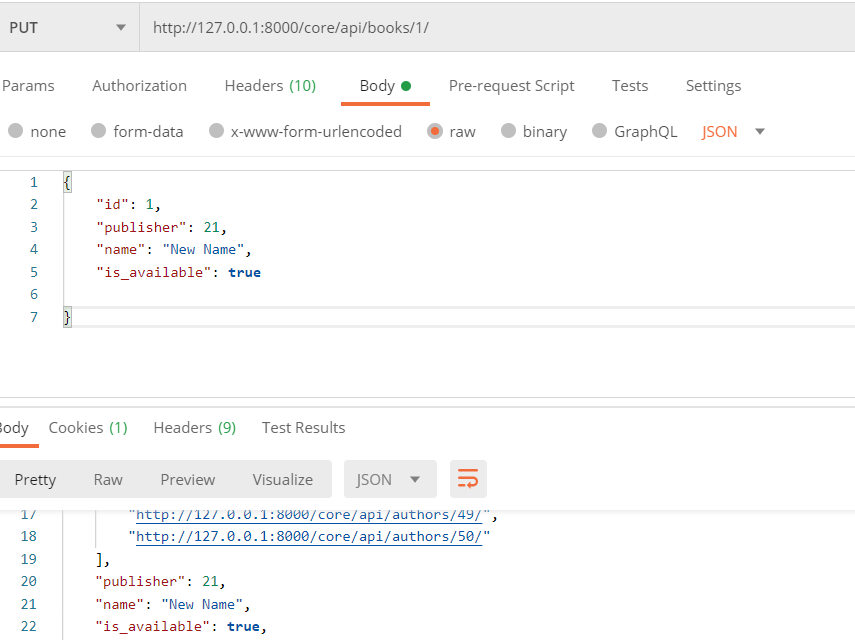
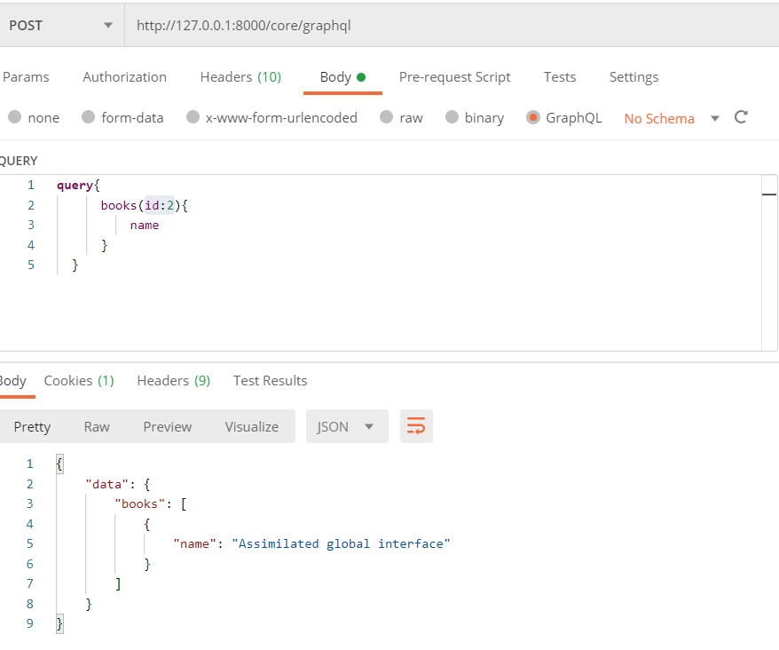
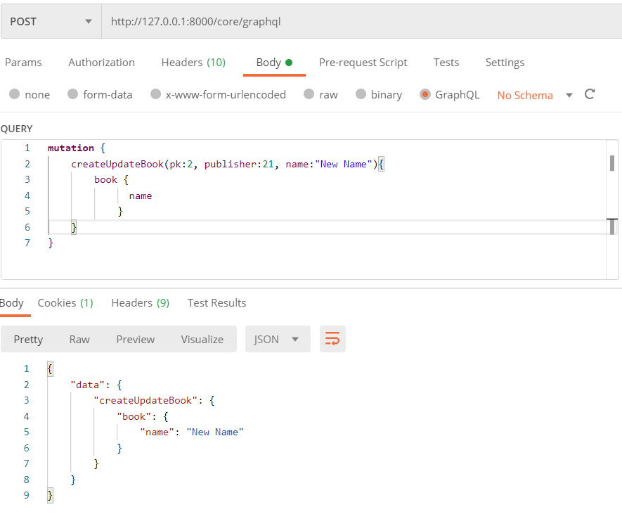

# Django Example API Application

Example Django App with REST, GraphQL and gRPC with Docker(Optional).

## <u>Installation</u>

Use the package manager [pip](https://pip.pypa.io/en/stable/) to install requirments.txt.

From project root DIR run

## <u>Usage(Docker)</u>

```bash
docker-compose up
```

---

## <u>Usage(Manual)</u>

To Set-up environment and dummy data.

```bash
pip install -r requirments.txt
python manage.py makemigrations
python manage.py migrate
python manage.py setup_dummydata
```

Run server in local environment.

```bash
python manage.py runserver
```

---

## <u>Features</u>

* Demo Books Gallery
* Basic DRF implementation(CRUD)
  * [Django REST framework](https://www.django-rest-framework.org/)
    * Authentication
      * Token Authentication
      * [JWT Authentication](https://django-rest-framework-simplejwt.readthedocs.io/en/latest/)
* Basic Graphql Implementation(CRUD)
  * [Graphene-Django](https://docs.graphene-python.org/projects/django/en/latest/)
    * Authentication
      * [JWT Authentication](https://django-graphql-jwt.domake.io/en/latest/)
      * [Django-Graphql-Auth](https://django-graphql-auth.readthedocs.io/en/latest/)
* Basic gRPC Implementation(CRUD)
  * [Django gRPC Framework](https://djangogrpcframework.readthedocs.io/en/latest/index.html)
    * Authentication
      * TODO.
* App Integrated with Docker(Optional)

---

## <u>API Usage Demo</u>

### **DjangoRestFramework:** `/core/api/`

* **Get JWT**

  ```javascript
  /api-jwt/token/
  {
      "username": "<USER_NAME>",
      "password": "<PWD>"
  }
  ```

* **Query Books -> GET**

  ```javascript
  /core/api/books/
  /core/api/books/<BOOK_ID>/
  ```

* **Create New Book -> POST**

  ```javascript
  /core/api/books/
  {
      "publisher": <Publisher_ID>,
      "name": "<BOOK_NAME>",
      "is_available": true
  }
    ```

* **Update Book -> PUT**

  ```javascript
  /core/api/books/<BOOK_ID>/
  {
      "id": <BOOK_ID>,
      "publisher": <Publisher_ID>,
      "name": "<BOOK NEW_NAME>",
      "is_available": true,
      
  }
  ```

  
  
* **Delete Book -> DELETE**

  ```bash
  /core/api/books/<BOOK_ID>/
  ```

---

### **GraphQL:** `/core/graphql`

* **Get JSON Web Token for Verified User**

  ```javascript
  mutation {
        tokenAuth(username: "<USER_NAME>", password: "<PWD>") {
          success
          errors
          token
          refreshToken
          user {
            username
          }
        }
    }
  ```

* **Query**

  ```javascript
  query{
      books {
        name
      }
  }
  ```

  **With Argument(Book ID).**

  ```javascript
  query{
      books(id:<BOOK_ID>){
          name
      }
  }
  ```

  

* **Mutation**

  **Create**

  ```javascript
  mutation {
            createUpdateBook(name:"<BOOK_NAME>", publisher: <Publisher_ID>, isAvailable:true, ....) {
              book {
                name
                isAvailable
                publisher {
                  name
                }
              }
            }
  }
  ```

  **Update**

  ```javascript
  mutation {
            createUpdateBook(pk:<BOOK_ID>, publisher:<Publisher_ID>, ....){
                ....
            }
        }
  ```

  

  **Delete**

  ```javascript
  mutation {
            createUpdateBook(pk:<BOOK_ID>){
                ....
            }
        }
  ```

---

### **gRPC:**

  **CRUD Operations**

  ```bash
  python manage.py gRPCBookClient
  ```
  
---

## Example JS

```javascript
$('#myFormSubmit').click(function(e){
  e.preventDefault();
  const api_type = $('#api-type').val();
  const book_id = $("#book-id").val();

  if (api_type.endsWith('GraphQL')){
    // Utilize GraphQL API
    const update_mutation = `mutation ($pk: ID!, $publisher: Int!, $book_is_available: Boolean, $book_name: String) 
    {
          createUpdateBook(
            pk:$pk,
            publisher:$publisher,
            isAvailable:$book_is_available,
            name:$book_name
      ){
          book{
              name
            }
        }
    }`
    
    $.ajax({
      method: "POST",
      url: '/core/graphql',  // GraphQL EndPoint
      data: JSON.stringify({
        query: update_mutation,
        variables: {
          pk: book_id,
          book_name: $("#book-name").val(),
          publisher: $("#publisher-id").val(),
          book_is_available: $("#is_available").val()
        }
      }),
      contentType: 'application/json',
      success: function(result) {
        $('#myModal').modal('hide')
        setInterval('location.reload()', 1000);
      }
    })
  }else{
    // Utilize REST API
    const update_url = `/core/api/books/${book_id}/`;  //REST EndPoint
    $.ajax({
      type: 'PUT',
      data : $('#apiForm').serialize(), 
      cache: false,
      dataType: 'json',
      url: update_url, 
      success: function(result) {
        $('#myModal').modal('hide')
        setInterval('location.reload()', 1000);
      }
    });
  }
});
```

## License

[MIT](https://choosealicense.com/licenses/mit/)